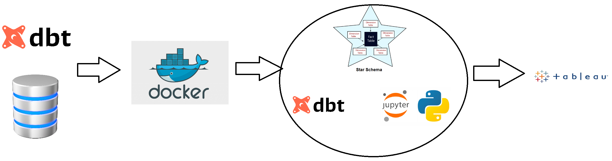
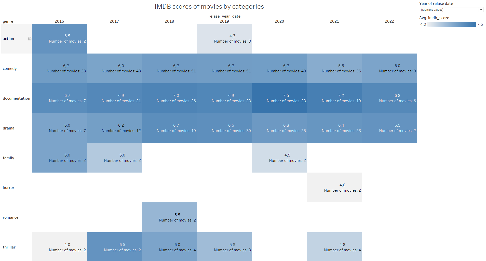

1. Contenerizing postgresql database and DBT using Docker
2. Building DWH (Star schema - fact table and dimensional table) using xlsx data - imdb_movies_shows.xlsx
3. Creating dashboard in Tableau

PROJECT DIAGRAM:

DASHBOARD IN TABLEAU:

